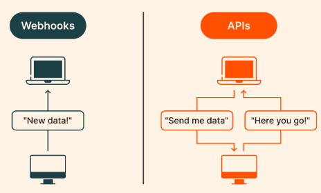

# Intro

The job (no pun intended) of the ***CronJob* controller** is to run one-off tasks on the Kubernetes cluster at regular intervals. It does this by building on top of the *Job* controller, whose task is to run one-off tasks once, seeing them to completion.

>  So I guess that we will have custom resource definition of new Kind **Cronjob** with some task and interval defined.

# Scaffold structure

- `go.mod` - dependencies
- `Makefile` - Make targets for building and deploying controller
- `PROJECT` - metadata about project

## go.mod

Obvious, all dependencies that kubebuilder uses.

## Makefile

Has defined:

- image name to use to all new images builded
- container tool (set to Docker by default)

PHONY is a makefile keyword to mark commands. Originally makefile is used to manage how files are generated from other files. However we sometimes use makefile to run commands like `install`, `clean`, `test`, `run`.  These are typically actions that you want to perform, rather than names of files to be generated. These targets are not filenames.  If you don't declare these non-file targets as `.PHONY`, and a file with the same name as the target exists in the directory, `Make` might get confused and not run your commands. By declaring a target as phony, you tell Make to ignore the file system and always run the commands associated with this target.

## PROJECT

```
# Code generated by tool. DO NOT EDIT.
# This file is used to track the info used to scaffold your project
# and allow the plugins properly work.
# More info: https://book.kubebuilder.io/reference/project-config.html
domain: tutorial.kubebuilder.io
layout:
- go.kubebuilder.io/v4
projectName: project
repo: tutorial.kubebuilder.io/project
resources:
- api:
    crdVersion: v1
    namespaced: true
  controller: true
  domain: tutorial.kubebuilder.io
  group: batch
  kind: CronJob
  path: tutorial.kubebuilder.io/project/api/v1
  version: v1
  webhooks:
    defaulting: true
    validation: true
    webhookVersion: v1
version: "3"
```

## config/

We also get launch configurations under the [`config/`](https://github.com/kubernetes-sigs/kubebuilder/tree/master/docs/book/src/cronjob-tutorial/testdata/project/config) directory.

Right now, it just contains [Kustomize](https://sigs.k8s.io/kustomize) YAML definitions required to launch our controller on a cluster, but once we get started writing our controller, it’ll also hold our CustomResourceDefinitions, RBAC configuration, and WebhookConfigurations.

> What is Kustomize? https://github.com/kubernetes-sigs/kustomize
>
> `kustomize` lets you customize raw, template-free YAML files for multiple purposes, leaving the original YAML untouched and usable as is.
>
> `kustomize` targets kubernetes; it understands and can patch [kubernetes style](https://kubectl.docs.kubernetes.io/references/kustomize/glossary/#kubernetes-style-object) API objects. It's like [`make`](https://www.gnu.org/software/make), in that what it does is declared in a file, and it's like [`sed`](https://www.gnu.org/software/sed), in that it emits edited text.
>
> How it works?
>
> In some directory containing your YAML [resource](https://kubectl.docs.kubernetes.io/references/kustomize/glossary/#resource) files (deployments, services, configmaps, etc.), create a [kustomization](https://kubectl.docs.kubernetes.io/references/kustomize/glossary/#kustomization) file.
>
> This file should declare those resources, and any customization to apply to them, e.g. *add a common label*.
>
> ```yaml
> apiVersion: kustomize.config.k8s.io/v1beta1
> kind: Kustomization
> commonLabels:
> 	app: myapp 
> resources:
> 	deployment.yaml
> 	service.yaml
> ```
>
> After you apply the file above on some directory (containing `deployment.yaml` and `service.yaml`) it will add common label `app:myapp` to them.

Each other directory contains a different piece of configuration, refactored out into its own base:

- [`config/manager`](https://github.com/kubernetes-sigs/kubebuilder/tree/master/docs/book/src/cronjob-tutorial/testdata/project/config/manager): launch your controllers as pods in the cluster
- [`config/rbac`](https://github.com/kubernetes-sigs/kubebuilder/tree/master/docs/book/src/cronjob-tutorial/testdata/project/config/rbac): permissions required to run your controllers under their own service account

# main.go

```go
package main

import (
    "flag"
    "os"

    // Import all Kubernetes client auth plugins (e.g. Azure, GCP, OIDC, etc.)
    // to ensure that exec-entrypoint and run can make use of them.
    _ "k8s.io/client-go/plugin/pkg/client/auth"

    "k8s.io/apimachinery/pkg/runtime"
    utilruntime "k8s.io/apimachinery/pkg/util/runtime"
    clientgoscheme "k8s.io/client-go/kubernetes/scheme"
    _ "k8s.io/client-go/plugin/pkg/client/auth/gcp"
    ctrl "sigs.k8s.io/controller-runtime"
    "sigs.k8s.io/controller-runtime/pkg/cache"
    "sigs.k8s.io/controller-runtime/pkg/healthz"
    "sigs.k8s.io/controller-runtime/pkg/log/zap"
    "sigs.k8s.io/controller-runtime/pkg/metrics/server"
    "sigs.k8s.io/controller-runtime/pkg/webhook"
    // +kubebuilder:scaffold:imports
)
```

Our package starts out with some basic imports. Particularly:

- The core [controller-runtime](https://pkg.go.dev/sigs.k8s.io/controller-runtime?tab=doc) library imported as `ctrl`
- The default controller-runtime logging, [Zap](https://pkg.go.dev/go.uber.org/zap) (more on that a bit later)

> **controller-runtime** - The Kubernetes controller-runtime Project is a set of go libraries for building Controllers. It is leveraged by [Kubebuilder](https://book.kubebuilder.io/) and [Operator SDK](https://github.com/operator-framework/operator-sdk). Both are a great place to start for new projects.

```go
var (
    scheme   = runtime.NewScheme()
    setupLog = ctrl.Log.WithName("setup")
)
```

Every set of controllers needs a [*Scheme*](https://book.kubebuilder.io/cronjob-tutorial/gvks#err-but-whats-that-scheme-thing), which provides mappings between Kinds and their corresponding Go types. We’ll talk a bit more about Kinds when we write our API definition, so just keep this in mind for later.

```go
func init() {
    utilruntime.Must(clientgoscheme.AddToScheme(scheme)) //we tell the util runtime that it must add our scheme variable to its client-go

    //+kubebuilder:scaffold:scheme
}
```

> golang: init() is called at the beginning of any package (even before main). When you import a package its init func is called.
>
> **client-go** - Go clients for talking to a [kubernetes](http://kubernetes.io/) cluster. https://github.com/kubernetes/client-go. K8s API client is a program that talks with cluster's kube-api-server

```go
func main() {
    // 1 --------------------------------------------
    var metricsAddr string
    var enableLeaderElection bool
    var probeAddr string
    flag.StringVar(&metricsAddr, "metrics-bind-address", ":8080", "The address the metric endpoint binds to.")
    flag.StringVar(&probeAddr, "health-probe-bind-address", ":8081", "The address the probe endpoint binds to.")
    flag.BoolVar(&enableLeaderElection, "leader-elect", false,
        "Enable leader election for controller manager. "+
            "Enabling this will ensure there is only one active controller manager.")
    // 2 --------------------------------------------
    opts := zap.Options{
        Development: true,
    }
    opts.BindFlags(flag.CommandLine)
    flag.Parse()

    ctrl.SetLogger(zap.New(zap.UseFlagOptions(&opts)))
    // 3 --------------------------------------------
    mgr, err := ctrl.NewManager(ctrl.GetConfigOrDie(), ctrl.Options{
        Scheme: scheme,
        Metrics: server.Options{
            BindAddress: metricsAddr,
        },
        WebhookServer:          webhook.NewServer(webhook.Options{Port: 9443}),
        HealthProbeBindAddress: probeAddr,
        LeaderElection:         enableLeaderElection,
        LeaderElectionID:       "80807133.tutorial.kubebuilder.io",
    })
    if err != nil {
        setupLog.Error(err, "unable to start manager")
        os.Exit(1)
    }
```

## 1

We setup some flags for metrics. Metrics that inform about the health of controller. Controller will open ports on which he will start HTTP server for such cause. 

## 2

Setup a logger

## 3

We instantiate a [*manager*](https://pkg.go.dev/sigs.k8s.io/controller-runtime/pkg/manager?tab=doc#Manager), which keeps track of running all of our controllers, as well as setting up shared caches and clients to the API server (notice we tell the manager about our Scheme).

We run our manager, which in turn runs all of our controllers and webhooks. The manager is set up to run until it receives a graceful shutdown signal. This way, when we’re running on Kubernetes, we behave nicely with graceful pod termination.

> **Manager** - Manager initializes shared dependencies such as Caches and Clients, and provides them to Runnables. A Manager is required to create Controllers. https://pkg.go.dev/sigs.k8s.io/controller-runtime/pkg/manager#Manager. 
>
> Start method of a Manager: Start starts all registered Controllers and blocks until the context is cancelled.

> **Webhook** - A webhook is an HTTP request, triggered by an event in a source system and sent to a destination system, often with a payload of data.
> 

