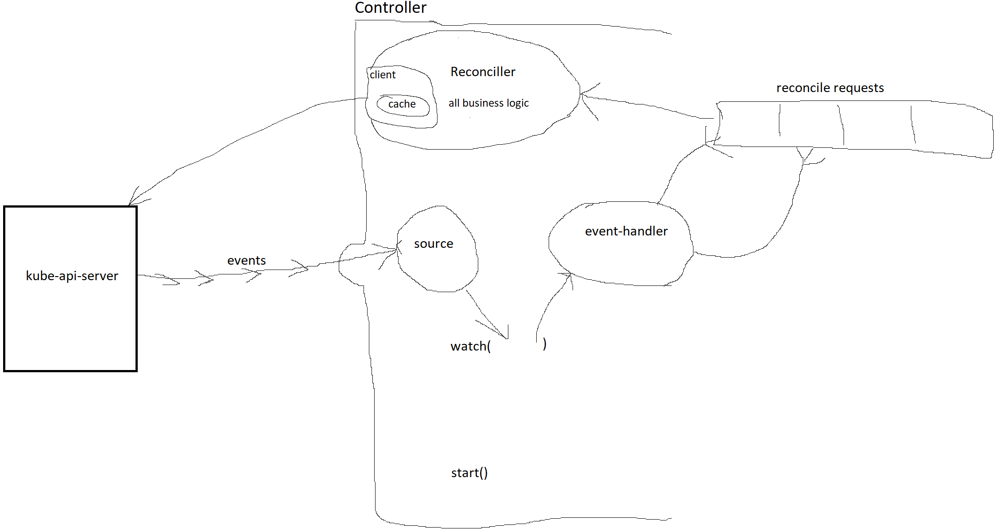

# Controller Runtime

The Kubernetes controller-runtime Project is a set of go libraries for building Controllers. It is leveraged by [Kubebuilder](https://book.kubebuilder.io/) and [Operator SDK](https://github.com/operator-framework/operator-sdk). 

## 1st iteration

### Client

Client provides a Read + Write client for reading and writing Kubernetes objects.

### Cache

Cache provides a Read client for reading objects from a local cache. A cache may register handlers to respond to events that update the cache.

### Manager

Manager is required for creating a Controller and provides the Controller shared dependencies such as clients, caches, schemes, etc. Controllers should be Started through the Manager by calling `Manager.Start`.

### Controller

Controller implements a Kubernetes API by responding to events (object Create, Update, Delete) and ensuring that the state specified in the Spec of the object matches the state of the system. This is called a reconcile. If they do not match, the Controller will create / update / delete objects as needed to make them match.

Controllers are implemented as worker queues that process `reconcile.Requests` (requests to reconcile the state for a specific object).

Unlike http handlers, Controllers DO NOT handle events directly, but enqueue Requests to eventually reconcile the object. This means the handling of multiple events may be batched together and the full state of the system must be read for each reconcile.

\* Controllers require a Reconciler to be provided to perform the work pulled from the work queue.

\* Controllers require Watches to be configured to enqueue `reconcile.Requests` in response to events.


### Admission Webhooks

> **Admission Webhooks** - allow you to intercept and modify requests sent to the Kubernetes API server before the persistence of the object, but after the request is authenticated and authorized. Some request comes to kube-api-server, kube-api-server authenticates and authorizes it. Then webhook can occur. Webhook receives the object from Api Requests, can perform some actions on it and gives it back. The kube-api-server persists the object. 
>
> The are two types of action webhook can do:
>
> - Validate - They can validate the request object and reject it if it doesn't meet specific criteria. 
> - Mutate - setting default values for fields, adding labels, injecting sidecar containers into pods etc. 

Admission Webhooks are a mechanism for extending kubernetes APIs. Webhooks can be configured with target event type (object Create, Update, Delete), the API server will send AdmissionRequests to them when certain events happen. The webhooks may mutate and (or) validate the object embedded in the AdmissionReview requests and send back the response to the API server.

There are 2 types of admission webhook: mutating and validating admission webhook. Mutating webhook is used to mutate a core API object or a CRD instance before the API server admits it. Validating webhook is used to validate if an object meets certain requirements.

\* Admission Webhooks require Handler(s) to be provided to process the received AdmissionReview requests.

### Reconciller

Reconciler is a function provided to a Controller that may be called at anytime with the Name and Namespace of an object. When called, the Reconciler will ensure that the state of the system matches what is specified in the object.

Example: Reconciler invoked for a ReplicaSet object. The ReplicaSet specifies 5 replicas but only 3 Pods exist in the system. The Reconciler creates 2 more Pods and sets their OwnerReference to point at the ReplicaSet with controller=true.

\* Reconciler contains all of the business logic of a Controller.

\* Reconciler typically works on a single object type. - e.g. it will only reconcile ReplicaSets. For separate types use separate Controllers. If you wish to trigger reconciles from other objects, you can provide a mapping (e.g. owner references) that maps the object that triggers the reconcile to the object being reconciled.

\* Reconciler is provided the Name / Namespace of the object to reconcile.

\* Reconciler does not care about the event contents or event type responsible for triggering the reconcile. - e.g. it doesn't matter whether a ReplicaSet was created or updated, Reconciler will always compare the number of Pods in the system against what is specified in the object at the time it is called.

### Source

`resource.Source` is an argument to `Controller.Watch` that provides a stream of events. Events typically come from watching Kubernetes APIs (e.g. Pod Create, Update, Delete).

Example: source.Kind uses the Kubernetes API Watch endpoint for a GroupVersionKind to provide Create, Update, Delete events.

\* Source provides a stream of events (e.g. object Create, Update, Delete) for Kubernetes objects typically through the Watch API.

\* Users SHOULD only use the provided Source implementations instead of implementing their own for nearly all cases.

### EventHandler

`handler.EventHandler` is an argument to `Controller.Watch` that enqueues `reconcile.Requests` in response to events.

Example: `a Pod Create event` from a `Source` is provided to the `eventhandler.EnqueueHandler`, which enqueues a `reconcile.Request` containing the name / Namespace of the Pod.

- EventHandlers handle events by enqueueing `reconcile.Requests` for one or more objects.

- EventHandlers MAY map an event for an object to a `reconcile.Request` for an object of the same type.

- EventHandlers MAY map an event for an object to a `reconcile.Request` for an object of a different type - e.g. map a Pod event to a reconcile.Request for the owning ReplicaSet.

- EventHandlers MAY map an event for an object to multiple reconcile.Requests for objects of the same or a different type - e.g. map a Node event to objects that respond to cluster resize events.

### Predicate

predicate.Predicate is an optional argument to Controller.Watch that filters events. This allows common filters to be reused and composed.

\* Predicate takes an event and returns a bool (true to enqueue)

\* Predicates are optional arguments




# 2nd iteration

## Client

Package client contains functionality for interacting with Kubernetes API servers.

This is not the same code, but the name client refers to the same thing as in here https://kubernetes.io/docs/reference/using-api/client-libraries/.

Simply it is a client for `kube-api-server`.

### Readers + Writers

Clients are split into two interfaces -- Readers and Writers. 

Readers:

- get and 
- -list, 

while Writers 

- create, 
- update, and 
- delete.

It is a common pattern in Kubernetes to read from a cache and write to the API server. This pattern is covered by the creating the Client with a Cache.

### Options

Many client operations in Kubernetes support options. These options are represented as variadic arguments at the end of a given method call. For instance, to use a label selector on list, you can call

```
err := someReader.List(context.Background(), &podList, client.MatchingLabels{"somelabel": "someval"})
```

### Indexing

Indexes may be added to caches using a FieldIndexer. This allows you to easily and efficiently look up objects with certain properties. You can then make use of the index by specifying a field selector on calls to List on the Reader corresponding to the given Cache.

For instance, a Secret controller might have an index on the `.spec.volumes.secret.secretName` field in Pod objects, so that it could easily look up all pods that reference a given secret.

### Object

The thing you are working with is `Object`. It reflects a Kubernetes API Object as pod, deployment etc.

```go
type Object interface {
	metav1.Object
	runtime.Object
}
```

https://pkg.go.dev/sigs.k8s.io/controller-runtime@v0.16.3/pkg/client#Object

### Get

```
package main

import (
	"context"

	corev1 "k8s.io/api/core/v1"
	"k8s.io/apimachinery/pkg/apis/meta/v1/unstructured"
	"k8s.io/apimachinery/pkg/runtime/schema"

	"sigs.k8s.io/controller-runtime/pkg/client"
)

var c client.Client

func main() {
	// Using a typed object.
	pod := &corev1.Pod{}
	// c is a created client.
	_ = c.Get(context.Background(), client.ObjectKey{
		Namespace: "namespace",
		Name:      "name",
	}, pod)

	// Using a unstructured object.
	u := &unstructured.Unstructured{}
	u.SetGroupVersionKind(schema.GroupVersionKind{
		Group:   "apps",
		Kind:    "Deployment",
		Version: "v1",
	})
	_ = c.Get(context.Background(), client.ObjectKey{
		Namespace: "namespace",
		Name:      "name",
	}, u)
}

```


# Controller

https://pkg.go.dev/sigs.k8s.io/controller-runtime@v0.16.3/pkg/controller